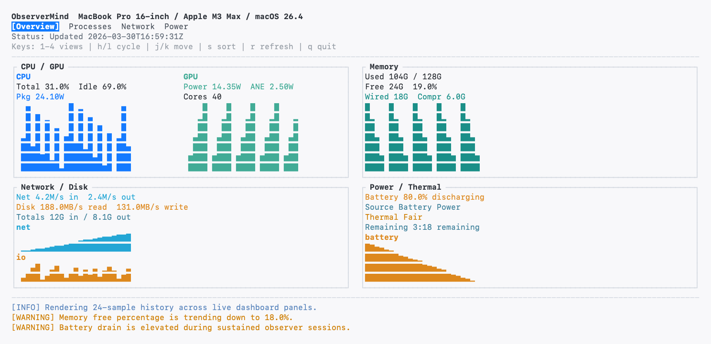
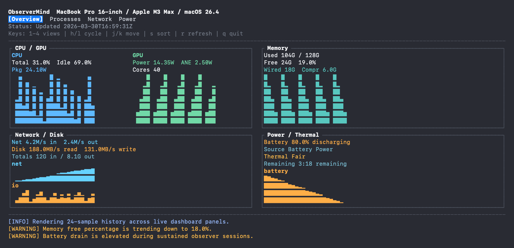

# ObserverMind

ObserverMind is a CLI-based monitoring cockpit for Apple Silicon Macs. It gives you a full-screen terminal dashboard for live system visibility, plus snapshot and stream commands for scripted collection.

| Light mode | Dark mode |
| --- | --- |
|  |  |

## Requirements

- Apple Silicon Mac
- macOS 15 or newer
- Swift 6.2 or newer to build from source

## Install

Build the package:

```bash
make build
```

Install a release binary to `~/.local/bin` by default:

```bash
make install
observer --help
```

Run directly from the package during development:

```bash
swift run observer --help
```

## Commands

Run the full-screen dashboard:

```bash
observer dashboard --interval 1 --theme auto
```

Capture one sample as a readable table:

```bash
observer snapshot
```

Capture one sample as JSON:

```bash
observer snapshot --format json
```

Stream JSON lines for automation or logging:

```bash
observer stream --interval 2 --duration 30
```

Use `sudo observer dashboard` when you want the richer power and GPU metrics that require elevated access.

## Configuration

ObserverMind reads configuration from `~/Library/Application Support/ObserverMind/config.json`.

```json
{
  "theme": "auto",
  "thresholds": {
    "highCPUPercent": 85,
    "lowMemoryFreePercent": 10,
    "highSwapGrowthMB": 256,
    "highDiskMBPerSec": 1024,
    "highBatteryDrainPercentPerHour": 15
  }
}
```

`theme` accepts `auto`, `light`, or `dark`. `auto` follows the current macOS appearance.

## Views and Controls

Views:

- `1` Overview
- `2` Processes
- `3` Network
- `4` Power

Controls:

- `h` / `l` or left/right arrows cycle views
- `j` / `k` or up/down arrows move through lists
- `s` cycles process sort when the Processes view is active
- `r` triggers an immediate refresh
- `q` quits the dashboard

## Refresh README Screenshots

The README screenshots are generated from deterministic fixture data so they stay stable across machines and runs.

```bash
./scripts/generate_readme_screenshots.sh
```

